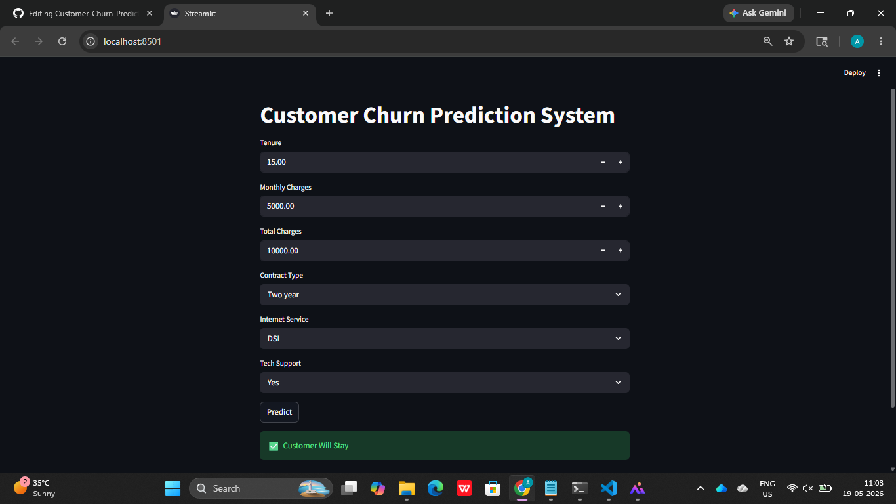

# Customer Churn Prediction

A Machine Learning project that predicts whether a customer will leave (churn) a company or not.

---

## 📌 Project Overview

Customer churn prediction helps businesses identify customers who are likely to stop using their services.  
This project uses Machine Learning algorithms to predict customer churn based on customer data.

---

## 🚀 Features

- Predict customer churn
- User-friendly Streamlit web app
- Machine Learning model integration
- Fast and simple interface

---

## 🛠️ Technologies Used

- Python
- Streamlit
- Scikit-learn
- Pandas
- NumPy
- Matplotlib
- Seaborn

---

## 📂 Project Structure

```bash
Customer-Churn-Prediction-App/
│
├── app.py
├── model.pkl
├── Requirement.txt
├── README.md
├── screenshot.png
└── notebook.ipynb
```

---

## 📊 Machine Learning Algorithm

- Logistic Regression
- Random Forest
You can also use:
- Decision Tree
- XGBoost

---

## ▶️ Run Locally

### Step 1: Clone Repository

```bash
git clone https://github.com/adarsh020106/Customer-Churn-Prediction-App.git
```

### Step 2: Move into Project Folder

```bash
cd Customer-Churn-Prediction-App
```

### Step 3: Install Dependencies

```bash
pip install -r requirements.txt
```

### Step 4: Run Streamlit App

```bash
streamlit run app.py
```

---

## 📈 Model Accuracy

```bash
Accuracy: 81%
```

---

## 📸 Application Screenshot


```md

```

---

## 🎯 Future Improvements

- Add more ML algorithms
- Improve UI design
- Deploy project online
- Add real-time prediction

---

## 👨‍💻 Author

Adarsh Singh

---

## ⭐ GitHub

If you like this project, give it a star ⭐